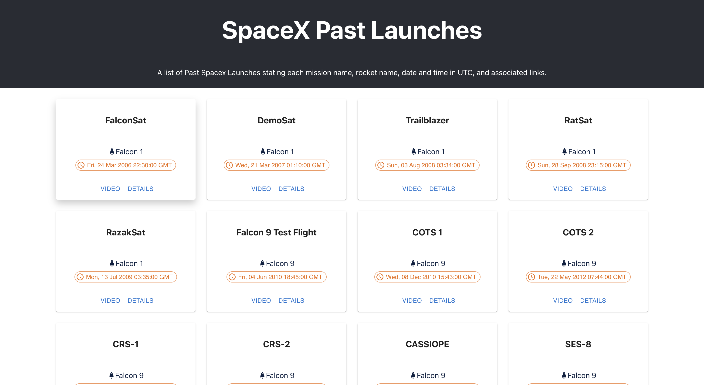

# SpaceX Past Launches Gallery

## Mission

Create a react web application, where on the home page it uses SpaceX’s GraphQL API (https://spacex-production.up.railway.app/) to fetch past launches (launchesPast) and display the following information about each launch:

- Mission name
- Date of the launch (in UTC)
- Name of the rocket used
- Link to article about the launch
- Link to the video of the launch

### Use Cases

Currently, the user can only view the main page and scroll through the list of past launches. The user can also find related sources of information/video on each launch card.

[WIP] To be updated as the app is being developed further.

## Preview



## Strategy

An Iterative approach is used to implement this app, where an mvp is done first, then enhancements follow. Following is An idea of the development cycle.

[Done]

- Create a react app.
- Create the main components.
  - App => List => Card
- Establish connection with API.
- Add Tests
- Document
- Clean/Refactor Components.
- Add UI Tweaks:
  - Add description in header
  - Display Date & time in UTC format.
  - Add Rocket icon.

[Next]

- Add Pagination -> on Client Side
- Add Sorting
- Add Filters

## Implementation

The home page dom tree contains the following:

- Main app component with header section
- Launches list
- Launch cards

### Fetching API Data

An ApolloClient is used to connect and query the graphQL API. The main query neded to fetch past launches data is

```graphql
# src/app/launch-list/launch-list.graphql

query LaunchesPast {
  launchesPast {
    mission_name
    launch_date_utc
    rocket {
      rocket_name
    }
    links {
      article_link
      video_link
    }
  }
}
```

## Usage

### `npm install`

Installs dependencies needed for the application.

### `npm run`

Runs the app in the development mode.
Open http://localhost:3000 to view it in the browser.

### `npm test`

Launches the test runner in the interactive watch mode.

## Structure

The app will be structured by features so components, styling, testing of a component would be next to each other.

src  
&nbsp; |  
&nbsp; |-pages  
&nbsp; |&nbsp; |-launches
&nbsp; |  
&nbsp; |-types  
&nbsp; |  
&nbsp; |-graphql  
&nbsp; |&nbsp; |-graphql.ts  
&nbsp; |
&nbsp; |-testing  

## Testing

_Tested:_ all components rendering successfully with no errors.

An apollo client with mock objects is created to fake the api.  
Since there is not really any user interaction for now, no further tests were needed.

## Caveats

- Assuming the app would be used in different timezones, dates displayed on the homepage are in UTC format. This ensures users can reference past events in same timezone which would be a consistent experience for users across different timezones.

## Future Improvements

- Add Pagination.
- Sort launches By launch date in a descending order to make recent events easily accessible, assuming users would be more interested to check for recent launches.
- Add select filters for rocket name, single launch date, and range launch date.
- Add search filters for mission name and rocket name.
- Add GraphQL introspection to speed the process of updating the schema in the future.
